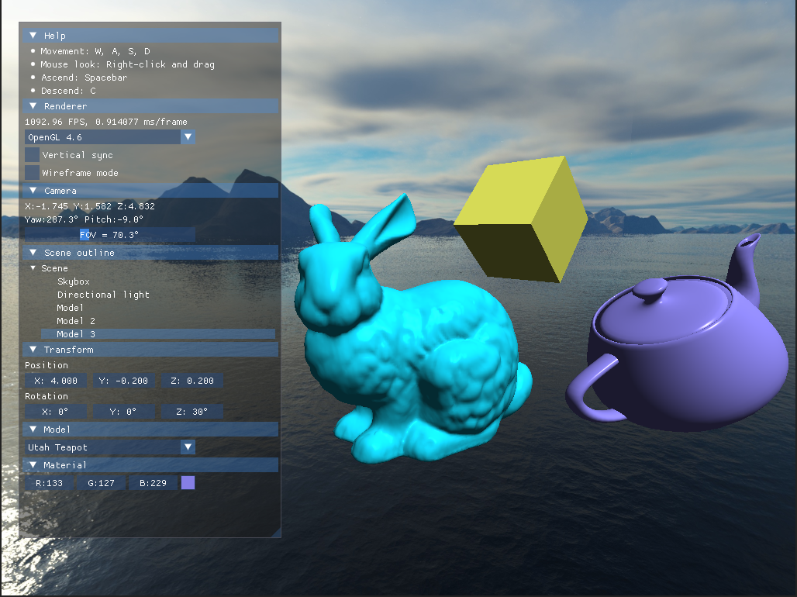

# Real-time C++ 3D renderer with OpenGL 4 and OpenGL ES 3

[](https://github.com/balintkissdev/3d-renderer-cpp/actions/workflows/main.yml)

> A hardware accelerated 3D renderer written in C++. Runs using OpenGL 4.3 as
graphics API on desktop and with OpenGL ES 3.0 in web browsers.



## Table of Contents

- [Try it out!](#try-it-out)
- [Features](#features)
- [Requirements](#requirements)
- [Build Instructions](#build-instructions)
- [Usage](#usage)
- [Resources](#resources)

## Try it out!

- [Live demo in web browser](https://www.balintkissdev.com/3d-renderer-cpp)
- [Windows 64-bit download](https://github.com/balintkissdev/3d-renderer-cpp/releases/download/0.0.1/3DRenderer-0.0.1-win64.zip)
- [Linux 64-bit download](https://github.com/balintkissdev/3d-renderer-cpp/releases/download/0.0.1/3DRenderer-0.0.1-linux-x86_64.AppImage)

## Motivation

This project is a demonstration of my ability to write cross-platform 3D
graphical applications. I designed my C++ application to balance the correct
level of abstractions and performance optimizations. The project showcases
confident usage of the following technologies:

- C++20
- Advanced CMake practices (modern CMake targets, FetchContent, CPack)
- OpenGL 4.x, OpenGL ES 3.x (GLES)
- Immediate mode overlay GUI using Dear ImGui (as opposed to retained mode GUI frameworks like Qt)
- Building for WebAssembly using Emscripten
- Clang Tooling (clang-format, clang-tidy)

I plan to use this project as reference when I do native game engine development projects at home.

Future additions will include Direct3D, Vulkan rendering backends and additional post-processing effects.

## Features

- 3D model display from `OBJ` file format
- Fly-by FPS camera movement
- Skybox display using cube-map
- Directional light with ADS (Ambient, Diffuse, Specular) lighting (Phong shading)
- Live browser demo

## Requirements

Desktop executable requires an OpenGL 4.3 compatible graphics adapter to run.
Check if your hardware supports OpenGL 4.3 and have the latest graphics driver
installed.

Web browser live demo requires support for OpenGL ES 3.0 used by WebGL2.

- C++20 compiler
- CMake 3.16 or newer

Required dependencies on Debian, Ubuntu, Linux Mint:

```sh
sudo apt install libwayland-dev libxkbcommon-dev xorg-dev
```

Required dependencies on Fedora, Red Hat:

```sh
sudo dnf install wayland-devel libxkbcommon-devel libXcursor-devel libXi-devel libXinerama-devel libXrandr-devel
```

All other dependencies are either included in `thirdparty` folder or automatically downloaded and built by `FetchContent` feature of CMake.

- [Assimp](https://assimp.org/)
- [Dear ImGui](https://github.com/ocornut/imgui)
- [GLFW](glfw.org)
- [OpenGL Mathematics (GLM)](https://github.com/g-truc/glm)
- [glad](https://gen.glad.sh/)
- [stb_image](https://github.com/nothings/stb/blob/master/stb_image.h)

## Build

1. Clone the repository

```sh
git clone https://github.com/balintkissdev/3d-renderer-cpp.git
cd 3d-renderer-cpp
```

2. Create `build` directory and navigate into it

```sh
mkdir build
cd build
```

3. Configure project with CMake

```sh
cmake .. # -DBUILD_WERROR=ON
```

`-DBUILD_WERROR`: Treating compiler warnings as errors is turned off by default,
but can be enabled with `-DBUILD_WERROR=ON` during CMake configure. The reason
for this is because the open source project idiom is to NOT enable build warnigns
as errors by default, and to avoid people with different build environments
finding different warnings unable to build without hacking the
`CMakeLists.txt` file. Warnings as errors are enabled for automated CI builds.

4. Build the project

```sh
cmake --build . --config Release
```

### Generate distributable package

This will be a ZIP file on Windows and AppImage on Linux.

```sh
cpack -C "Release"
```

### WebAssembly build

Install
[Emscripten](https://emscripten.org/docs/getting_started/downloads.html) on
your system then issue the commands for configure and build similar as before,
but in the Emscripten build environment.

```sh
source <emsdk install location>/emsdk_env.sh

cd build
emcmake cmake ..
emmake make
```

Opening the resulting `3Drenderer.html` file with the browser will not work because of
default browser CORS rules. You can either use a live server locally to access
at `http://localhost:8000`

```sh
python -m http.server
```

or alternatively use `emrun 3DRenderer.html --port 8000`.

## Usage

After building, run the executable in the `build` directory. On Windows:

```cmd
3DRenderer.exe
```

On Linux:

```cmd
./3DRenderer
```

Use keyboard and mouse to navigate the 3D environment.

- Movement: `W`, `A`, `S`, `D`
- Mouse look: `Right-click` and drag
- Ascend: `Spacebar`
- Descend: `C`

Modify UI controls to change properties of the 3D model display.

## Resources

- *Utah Teapot* and *Stanford Bunny* model meshes are from [Stanford Computer Graphics Laboratory](https://graphics.stanford.edu/)
    - High poly *Stanford Bunny* model mesh is from https://www.prinmath.com/csci5229/OBJ/index.html
- Skybox texture images are from [learnopengl.com](https://learnopengl.com/Advanced-OpenGL/Cubemaps)
